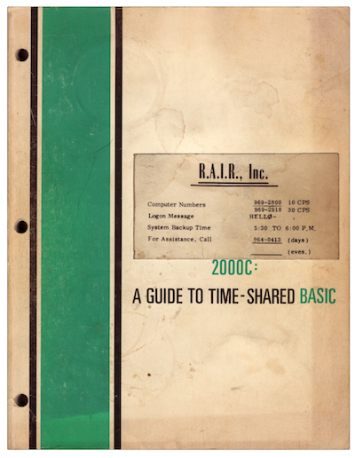

###########################
Star Trader: Original BASIC
###########################

Introdcution
============

More often than not, you will find old *Star Trader* BASIC files on the
Internet annotated as being written in HP BASIC. This could reference HP's old
BASIC dialect from the 70s, or it could reference the HP BASIC that was
inherited from DEC through the Compaq acquisition.

DEC BASIC History
=================

.. image:: ../../resources/images/DEC-PDP-11-BASIC-PLUS-Language-Manual-Cover-400.png

* **1971: BASIC-PLUS** - This is the earliest year I could find reference to
  DEC's BASIC-PLUS for the PDP-11. The manual cover above is from the second
  edition (third printing) of the language manual. BASIC-PLUS ran on 16-bit DEC
  PDP-11s (RSTS). BASIC-PLUS touted itself as an extension of the BASIC language
  that was developed at Dartmouth College.

* **1977: BASIC-PLUS-2** - The first printing of the BASIC-PLUS-2 language
  manual was in 1977. This version of the language was also for the PDP-11, but
  could run on DEC's RSTS, RSX, and DECSYSTEM-20 operating systems. Due to
  memory enhancements, BASIC-PLUS-2 programs could be much larger than those
  written in BASIC-PLUS.

* **1982: VAX BASIC** - Sometime after DEC came out with VAX/VMS in 1977, it
  ported BASIC-PLUS-2 to the new system. The earliest manual I could find was
  a first printing in 1982. Liekly, however, a different series of manuals had
  early print dates, closer to the release of VAX/VMS.

* **1992: DEC BASIC** - When DEC created the Alpha microprocessor, it ported
  VAX/VMS, renaming it OpenVMS. VAX BASIC was also ported, and renamed DEC
  BASIC in the process.

* **1998: Compaq** - With the acquisition of DEC by Compaq, the two flavors of
  DEC BASIC were renamed "Compaq BASIC for OpenVMS VAX" and
  "Compaq BASIC for OpenVMS Alpha".

* **2002: HP** - With the acquisition of Compaq by HP, they were renamed yet
  again: "HP BASIC for OpenVMS on VAX" and
  "HP BASIC for OpenVMS on AlphaServer".

HP 2000 BASIC History
=====================

HP BASIC 2000 is somewhat harder to trace. The manuals I was able to find are
as follows:

* **1971: HP 2000C - A Guide to Time-Shared BASIC**

* **1972: HP 2000E- A Guide to Time-Shared BASIC**

* **1975: HP 2000/Access BASIC Reference Manual**

* **1976: HP 2000/Access Learning Time-Share BASIC**

So Which Is It?
===============

The original *Star Trader* was written in 1973, before BASIC-PLUS-2 came along.
If Dave Kaufman created it on a PDP-11, then the dialect was undoubtedly
BASIC-PLUS. I have not been able to obtain a copy of the game as it was
published by the *People's Computer Company* newsletter, which might have more
info about the system the game was written on.

This being said, there is evidence that if an early version of the game was not
written on HP 2000 BASIC, it was very likely ported to it. Pete of
dunnington.u-net.com reports that his copies were extraced from an image of an
HP library tape. Earlier on his page, he mentioned extraced HP 2000 BASIC files
from library tapes.