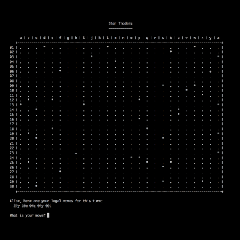
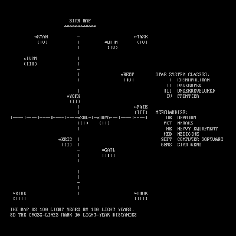
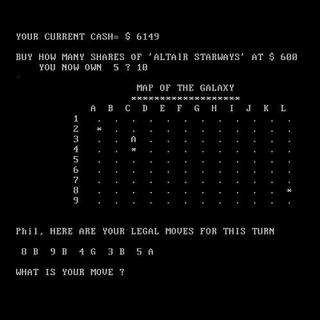

############
Star Traders
############

*Nostalgic Implementations*

Background
==========

*Star Trader* was a BASIC game written by Dave Kaufman and published by the
"People's Computer Company" in 1974. It seems to have been written in 1973,
however.

Over the years, it was copied and then heavily modified, morphing into what
became *Star Lanes* by the late 70s and early 80s. (Note that some *Star Lanes* versions of the game still used the ``TRADE.BAS`` filename, while others
switched to ``LANES.BAS``.)

The *Star Trader* lineage of games inspired a list of excellent games; the
`Wikipedia article`_ even claims that EVE Online traces its ancestry to
*Star Trader*. There is also a page that provides a `timeline`_ of
*Star Trader*, should you want to explore this further.

The differences of the original two variantes of the game are briefly
outlined below.

Star Trader
-----------

In *Star Trader*, players travel about the star map buying and selling six types
of merchandise: uranium, metals, gems, software, heavy equipment, and medicine.

Star Lanes
-----------

In *Star Lanes*, players take turns building outposts, creating companies, and
purchasing stock.

Implementations
===============

For now, the implementations below are focusing on the *Star Lanes* version of
the game. Each implementation has its own README:

* `Hy`_ (Python Lisp)

* `LFE`_ (Lisp Flavored Erlang)

* `Clojure`_

* `Racket`_

.. Links
.. -----
.. _Wikipedia article: http://en.wikipedia.org/wiki/Star_Trader
.. _timeline: http://wiki.classictw.com/index.php?title=Inside_TradeWars_-_History_-_Timeline
.. _Hy: hy/README.rst
.. _LFE: lfe/README.rst
.. _Clojure: clojure/README.rst
.. _Racket: racket/README.rst
